# PORTFOLIO

Demonstrating design projects for web and/or mobile platforms.

----

#### 1. INTRODUCTION

####       **YUHAN YIN**

​	(347) 204-8114

​	blossomyyh@gmail.com

​	Link: [github.com/blossomyyh/portfolio](https://github.com/blossomyyh/portfolio)

​	Blog: [blossomyyh.github.io](https://blossomyyh.github.io)

​	Brooklyn, NY

-----

#### 2. PROJECTS

- **Parkour Game** Design & Implementation(C++ & Cocos2d)

  - A Cocos2d running game - implemented by C++ [freshman project]

  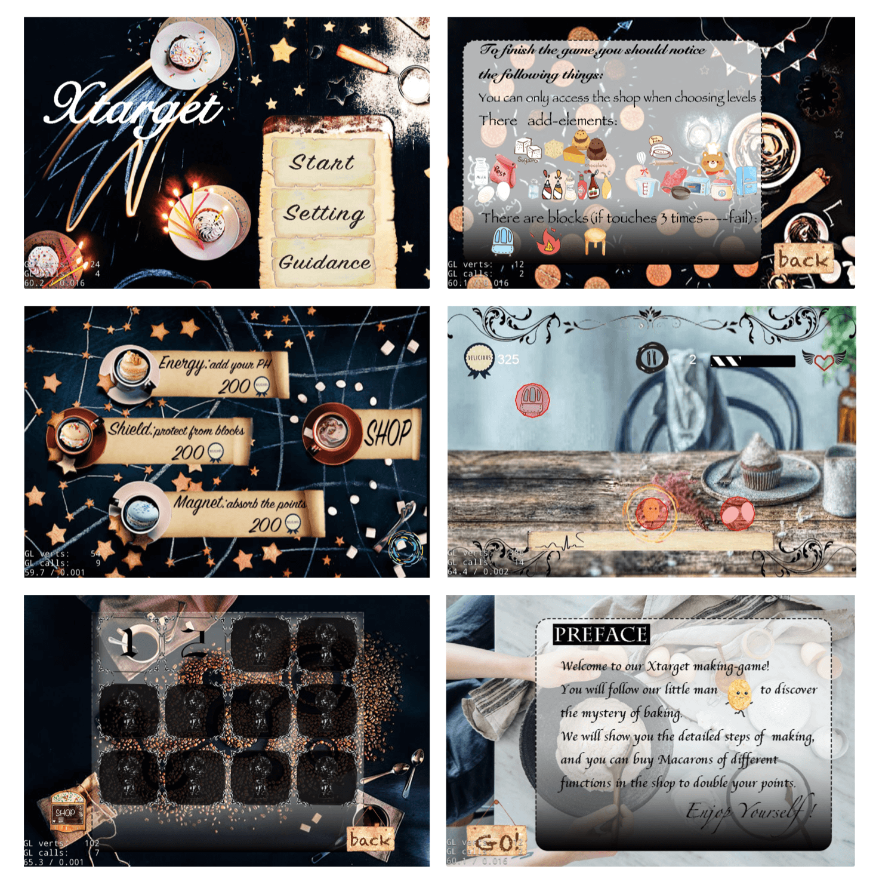

  ​

- **TICKIT - Online Ticket Platfrom** Design & Implementation  (Android Platform)

  - AWARD PROJECT | SEP 2017 - JUN 2019

  - Awarded Entrepreneurship Joint Fund by accomplishing Android platform for both admin and normal users to manage tickets.

  - Led team of three, including user requirement analysis, feature development and software testing.

  - Implemented View part by Kotlin & Java with MVP design pattern.

  - CODE - <https://github.com/Blossomyyh/TICKIT>

  - Protocol

    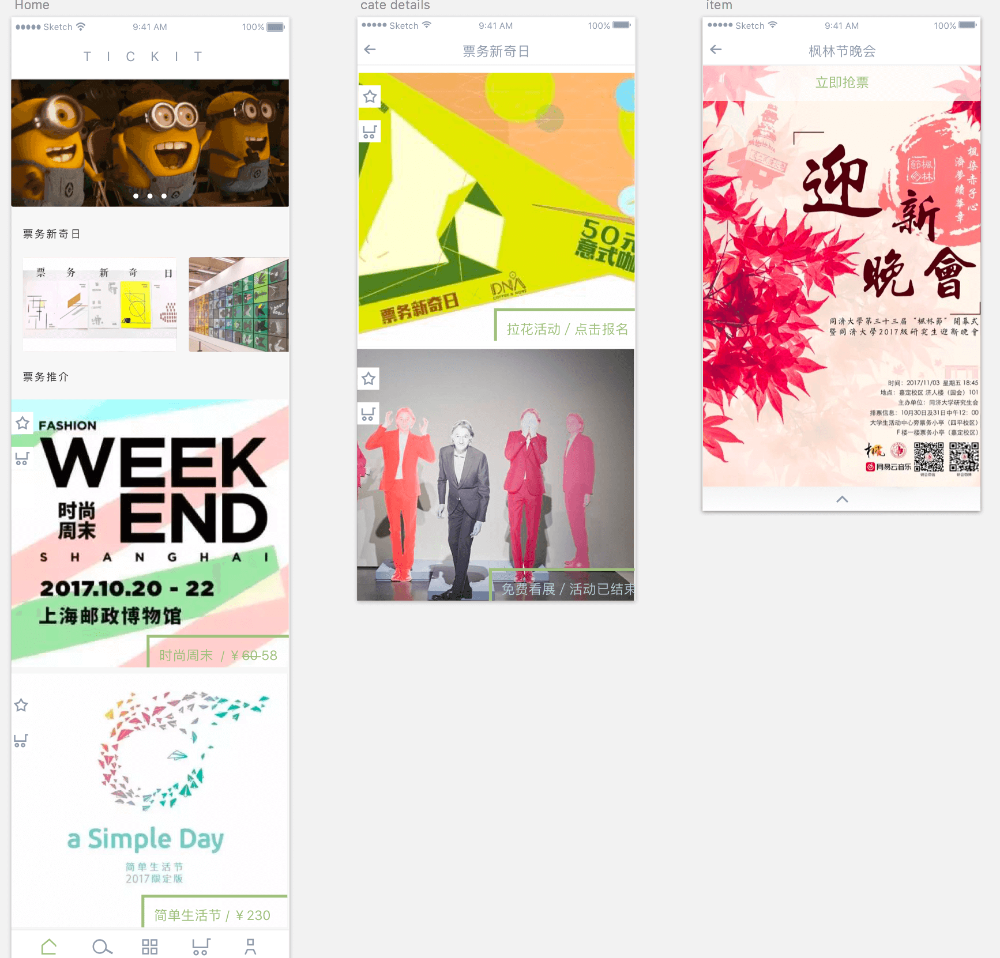

    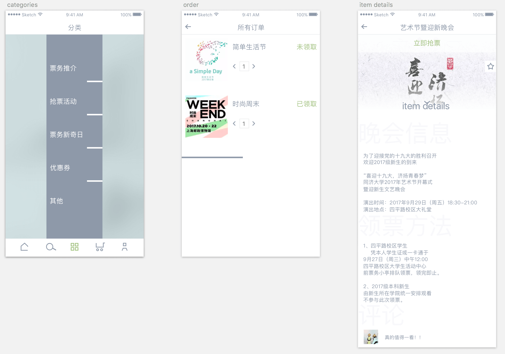

  - Implementation (more illustration on the link above)

    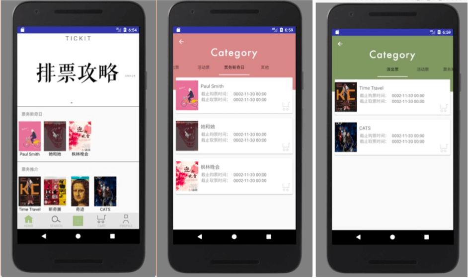

    ​

- **MEST - Memo-list with AR Feature** Design & Implementation  (iOS Platform)

  - Design

    - Fragment 1 - normal todo-list
    - Fragment 2 - AR Feature to use camera to enter the AR environment and record your path of the way to find your secret things

  -  Implementation

    - PRESENTATION  https://prezi.com/view/ycV5IQHV3HwQD6Dfbeuv
    - DEMO  `./Mest-demo.mp4`
    - Pull View
    - ARKit

    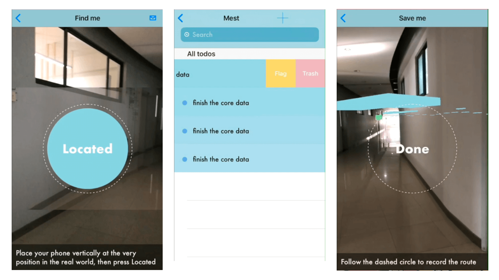

- **TSUBASA - Drama Game** Design & Implememtation  (Web Platform)

  - Game Design

    - show plot and character with ppt effect 
    - interaction 

    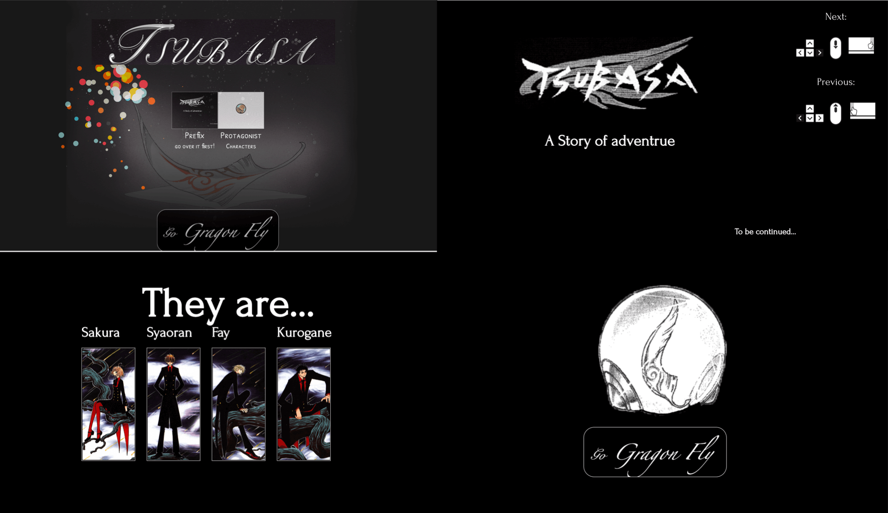

    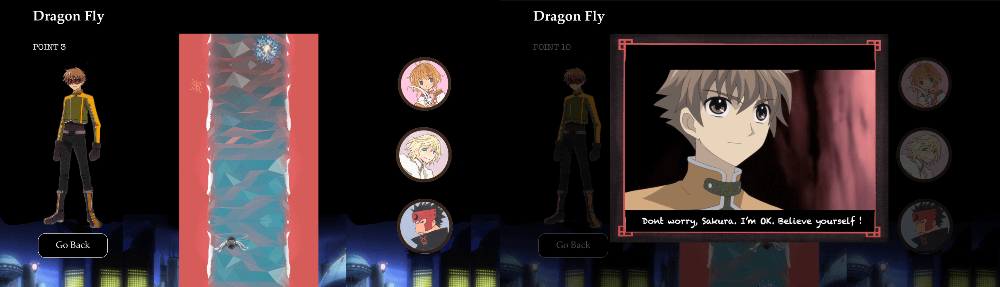

    ​

  - Implemetation 

    - DEMO `./tsubasa-demo.mp4`

    - CODE  <https://github.com/Blossomyyh/Tsubasa>

    - Vue.js  framework

    - eagle.jss

      ​

- **Memo - Todo-list** (with new gesture features) Design & Implementation  (Web Platform)

  - New Feature - Love design in SURU App 

    - Clear Appearance
    - Touch everywhere to create new list
    - Drag title to change whole theme

  - Implement by node.js

    

    

    ​

- **SuperSchedule - Schedule App** Protocol Design

  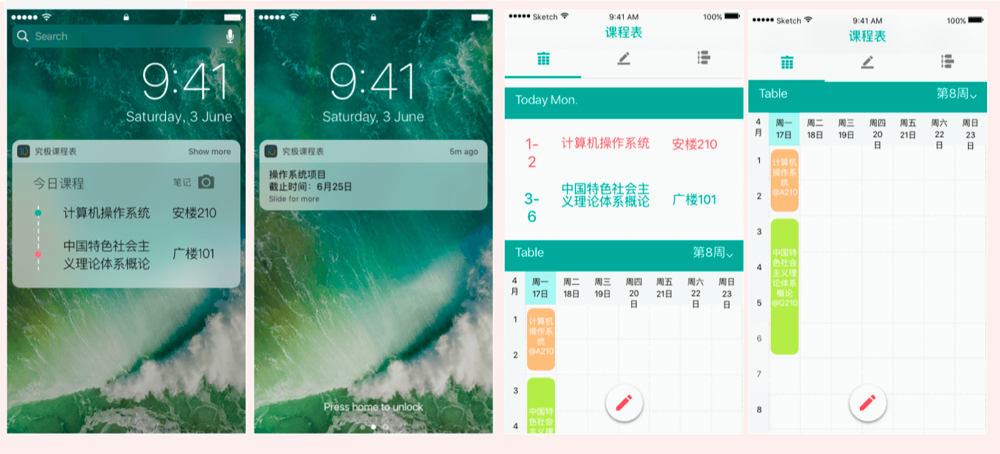

  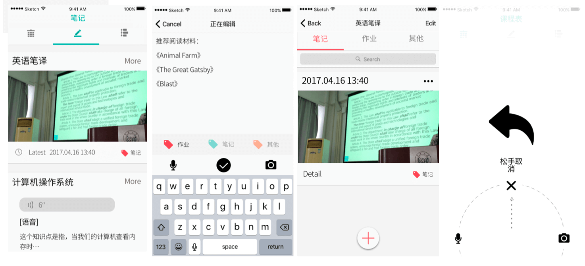

  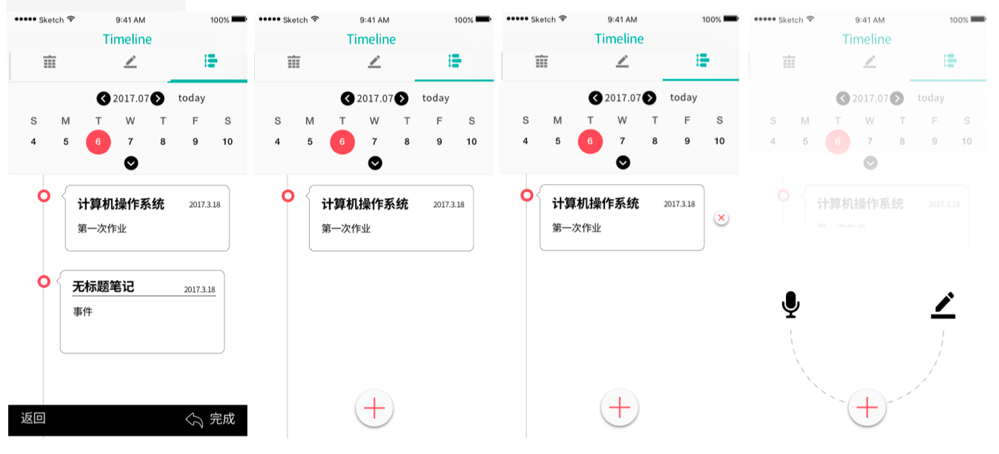

  ​

- **Management system - Database visualization** Protocol Design

  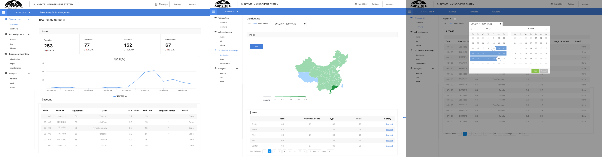

  ​

- Other Graphic Design

  - App Protocol Design

    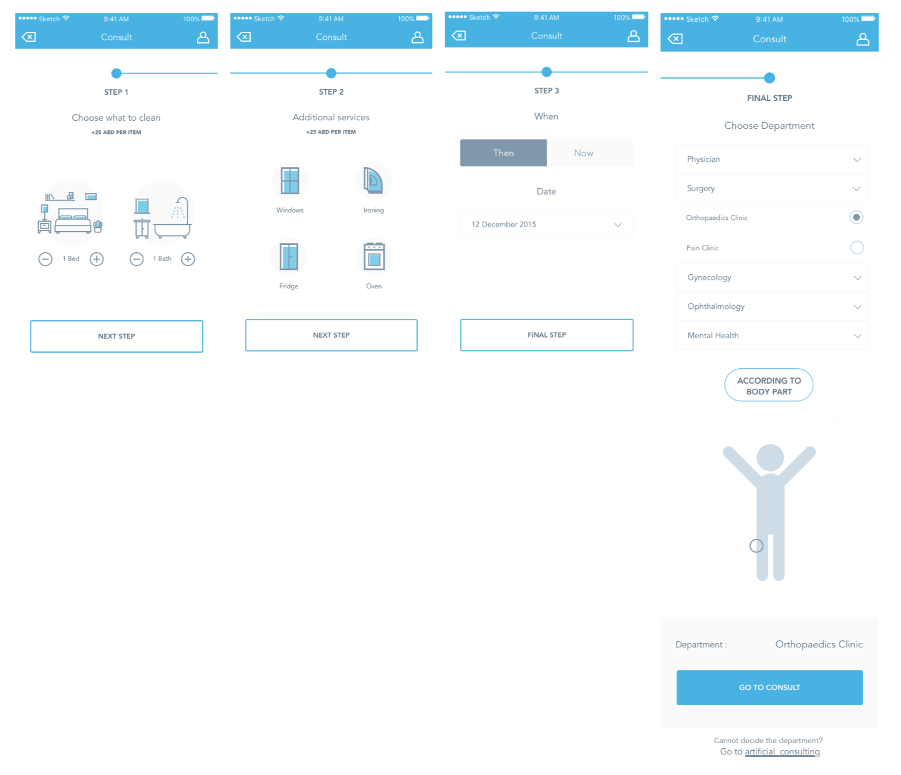

    ​

  - Invitation Card Design

    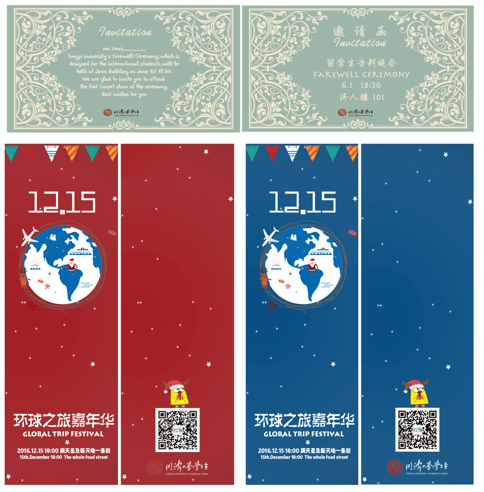

    ​

  - Poster Design

    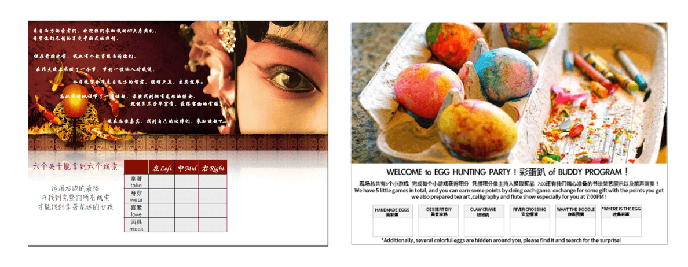

----

#### 3. EXPERIENCE

- **SAP** LABS CHINA - **JAM MOBILE TEAM**
  - **INTERN** | AUG 2018 - MARCH 2019
  - Optimization of Jam App performance by <u>developing QR scan</u> interfaces with MLkit.
  - Implementation of automation test by Ruby as well as undertaking regression tests of Jam App on <u>both iOS and Android</u>

------

#### 4. EDUCATION

- **New York University**
  - Master of Engineering <u>Computer Engineering</u>
  - 2019.9 - 2021.5
- **Tongji University**
  - Bachelor of Engineering <u>Software Engineering</u>
  - 2015.9 - 2019.7 
  - GPA: 88.76/100

----

#### 5. INTERESTS

- Love Design
- Love Human Computer Interaction
- Love Front-end
- Experience with **Design Tools** (e.g. Sketch, Photoshop, Principle, Flinto, Illustrator, After Effects…)
- Though mainly focused on sComputer Science during school year, I also attended **Innovation and Design** courses like `User Interface Design/Interaction, Appreciation of Design, Appreciation of Product Design, Management of Artistic Activities etc.`

-----

#### GRATITUDE

I really appreciate this amazing opportunity to gain experience in **User Experience**. Wish to hear from you soon!